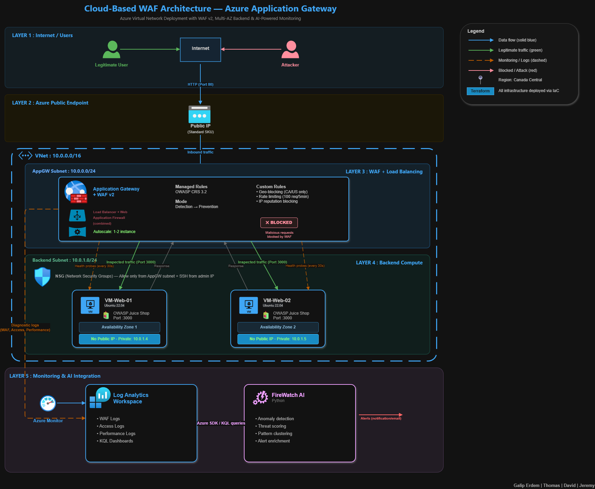
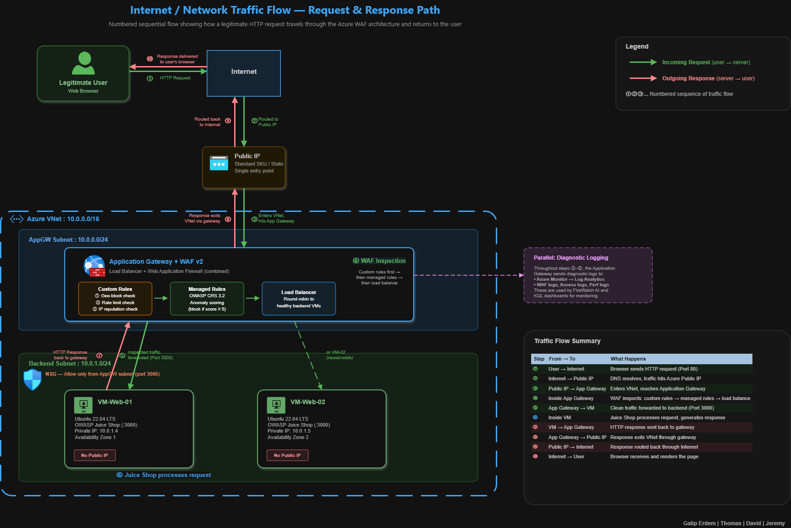

# Azure Cloud-Based Web Application Firewall (WAF)

A hands-on cloud security project deploying an Azure Application Gateway with WAF v2 to protect a vulnerable web application (OWASP Juice Shop). 

## What This Project Does

This project deploys a complete WAF environment on Azure using Terraform:

- **2 web servers** running OWASP Juice Shop (a deliberately vulnerable app) behind a load balancer
- **Azure Application Gateway with WAF v2** inspecting all traffic before it reaches the servers
- **Managed rules** (OWASP CRS 3.2) blocking SQL injection, XSS, and other OWASP Top 10 attacks
- **Custom rules** for geo-blocking, rate limiting, and IP reputation blocking
- **Azure Monitor + Log Analytics** for logging, dashboards, and alerting
- **FireWatch AI application** (Python) for intelligent threat analysis beyond what rules catch

## Architecture



## Network Flow Diagram



## Prerequisites

| Tool | Version | Purpose |
|------|---------|---------|
| [Terraform](https://developer.hashicorp.com/terraform/install) | >= 1.5 | Infrastructure deployment |
| [Azure CLI](https://learn.microsoft.com/en-us/cli/azure/install-azure-cli) | >= 2.50 | Azure authentication |
| [Git](https://git-scm.com/) | any | Version control |
| Azure for Students subscription | $100 credit | Cloud resources |

---

## Setup Guide

### Step 1: Install Tools

#### Windows (without WSL)

1. **Terraform:** Download from [developer.hashicorp.com/terraform/install](https://developer.hashicorp.com/terraform/install). Extract the `.zip`, move `terraform.exe` to a folder (e.g., `C:\tools\`), and add that folder to your system PATH.

2. **Azure CLI:** Download and run the MSI installer from [learn.microsoft.com](https://learn.microsoft.com/en-us/cli/azure/install-azure-cli-windows).

3. **Git:** Download from [git-scm.com](https://git-scm.com/). During install, select "Git from the command line and also from 3rd-party software." This also installs **Git Bash**, which provides `ssh-keygen` on Windows.


Verify everything (in PowerShell or Git Bash):
```
terraform --version
az --version
git --version
```

#### Windows (with WSL)

```bash
# Terraform
sudo apt-get update && sudo apt-get install -y gnupg software-properties-common
wget -O- https://apt.releases.hashicorp.com/gpg | gpg --dearmor | sudo tee /usr/share/keyrings/hashicorp-archive-keyring.gpg > /dev/null
echo "deb [signed-by=/usr/share/keyrings/hashicorp-archive-keyring.gpg] https://apt.releases.hashicorp.com $(lsb_release -cs) main" | sudo tee /etc/apt/sources.list.d/hashicorp.list
sudo apt-get update && sudo apt-get install terraform

# Azure CLI
curl -sL https://aka.ms/InstallAzureCLIDeb | sudo bash
```

#### macOS

```bash
brew install terraform azure-cli git python
```

#### Linux (Ubuntu/Debian)

Same as WSL instructions above.

---

### Step 2: Generate an SSH Key

The Azure VMs use SSH key authentication (no passwords). You need an SSH key pair on your machine.

**Check if you already have one:**
```bash
# macOS / Linux / WSL / Git Bash:
ls ~/.ssh/id_ed25519.pub

# Windows PowerShell:
dir $env:USERPROFILE\.ssh\id_ed25519.pub
```

If the file exists, skip to Step 3. If not found, generate one:

#### Windows (PowerShell)

```powershell
ssh-keygen -t ed25519 -C "your-email@example.com"
```

When prompted:
- **File location:** Press Enter to accept the default (`C:\Users\YourName\.ssh\id_ed25519`)
- **Passphrase:** Press Enter for no passphrase, or set one you'll remember

Your keys are now at:
- Private: `C:\Users\YourName\.ssh\id_ed25519`
- Public: `C:\Users\YourName\.ssh\id_ed25519.pub`

#### macOS / Linux / WSL / Git Bash

```bash
ssh-keygen -t ed25519 -C "your-email@example.com"
```

Keys go to `~/.ssh/id_ed25519` and `~/.ssh/id_ed25519.pub`.

> **Why SSH keys?** Terraform installs your public key on the VMs so you can SSH in for troubleshooting. Password authentication is disabled — SSH keys are the security best practice.

---

### Step 3: Azure Setup

```bash
# Login to Azure (opens browser)
az login

# Verify your subscription
az account show -o table

# Register required resource providers (one-time per subscription)
az provider register --namespace Microsoft.Network
az provider register --namespace Microsoft.Compute
az provider register --namespace Microsoft.Storage
az provider register --namespace Microsoft.OperationalInsights
az provider register --namespace Microsoft.Insights

# Verify registration (wait until all show "Registered")
az provider show -n Microsoft.Network --query "registrationState" -o tsv
az provider show -n Microsoft.Compute --query "registrationState" -o tsv
az provider show -n Microsoft.Storage --query "registrationState" -o tsv
az provider show -n Microsoft.OperationalInsights --query "registrationState" -o tsv
az provider show -n Microsoft.Insights --query "registrationState" -o tsv
```

> **Why manual registration?** Azure for Students subscriptions can't auto-register providers (causes 409 Conflict errors). This is a one-time setup per subscription — once registered, it persists across all machines.

---

### Step 4: Configure Terraform Variables

```bash
cd terraform/
cp terraform.tfvars.example terraform.tfvars
```

Edit `terraform.tfvars` with your values:

```hcl
# Your Azure subscription ID
# Find it:  az account show --query id -o tsv
subscription_id = "your-subscription-id-here"

# Your public IP (for SSH access)
# Find it:
#   macOS/Linux/WSL:  curl -s ifconfig.me
#   PowerShell:       Invoke-RestMethod ifconfig.me
allowed_ssh_ip = "your-public-ip-here"

# Path to your SSH public key
#   Windows (PowerShell): "C:/Users/YourName/.ssh/id_ed25519.pub"
#   Windows (Git Bash):   "~/.ssh/id_ed25519.pub"
#   macOS/Linux/WSL:      "~/.ssh/id_ed25519.pub"
ssh_public_key_path = "~/.ssh/id_ed25519.pub"
```

**Important (Windows):** Use **forward slashes** (`/`) in the key path, not backslashes:
```
✅ "C:/Users/Username/.ssh/id_ed25519.pub"
❌ "C:\Users\Username\.ssh\id_ed25519.pub"
```

---

### Step 5: Deploy

```bash
cd terraform/
terraform init       # Download providers (first time only)
terraform plan       # Preview what will be created
terraform apply      # Deploy everything (type "yes" to confirm)
```

Deployment takes **12-15 minutes** (Application Gateway is slow to provision). After it completes, wait **3-4 more minutes** for Juice Shop to start on the VMs.

Get your URL and test:
```bash
terraform output juice_shop_url
curl http://$(terraform output -raw appgw_public_ip)/
```

Open the URL in your browser — you should see OWASP Juice Shop.

---

### Step 6: Destroy (IMPORTANT — to save credit)

```bash
terraform destroy    # Tears down everything (type "yes" to confirm)
```

> **Cost warning:** The WAF v2 charges ~$0.36/hr. Always `terraform destroy` when not actively working. Re-deploy with `terraform apply` — everything rebuilds identically.

---

## State Management

Terraform tracks deployed resources in a local **state file** (`terraform.tfstate`). Important things to know:

- **Always deploy and destroy from the same machine.** If you run `terraform apply` on Machine A, run `terraform destroy` on Machine A.
- **State is NOT stored in Git** — it contains sensitive data (subscription IDs, resource details). It's in `.gitignore`.
- If you need to deploy from a different machine, destroy from the original machine first, or use the emergency cleanup command below.

### Emergency: Resources Running but No State File

If you deployed from one machine and need to destroy from another (e.g., forgot to destroy before leaving home):

```bash
# Delete the entire resource group directly through Azure CLI — no state needed
az group delete --name rg-waf-project --yes --no-wait
```

Then on your current machine, clean up any stale local state before deploying fresh:

```bash
cd terraform/
rm -f terraform.tfstate terraform.tfstate.backup
terraform apply    # Fresh deploy from clean state
```

---

## Project Structure

```
azure-waf-project/
├── terraform/              # All infrastructure as code
│   ├── main.tf             # Provider config, resource group
│   ├── variables.tf        # All configurable variables
│   ├── outputs.tf          # Values shown after deploy (URLs, IPs)
│   ├── network.tf          # VNet, subnets, NSGs
│   ├── compute.tf          # 2 VMs with Juice Shop (cloud-init)
│   ├── appgateway.tf       # Application Gateway + WAF v2
│   ├── waf-policy.tf       # WAF rules (managed + custom)
│   ├── monitoring.tf       # Log Analytics + diagnostic settings
│   └── README.md           # Terraform-specific documentation
├── testing/                # Attack scripts and evidence
├── deliverables/           # Assignment submissions
├── diagrams/               # Architecture diagrams (.drawio)
└── README.md               # This file
```

---

## Cost Estimate

| Resource | Hourly Cost | Notes |
|----------|-------------|-------|
| Application Gateway WAF_v2 | ~$0.36/hr | Most expensive — destroy when idle |
| 2x Standard_B1s VMs | ~$0.02/hr total | Very cheap |
| Public IP (Standard) | ~$0.005/hr | Minimal |
| Log Analytics | Per GB ingested | Negligible for this project |
| **Total per session** | **~$2-3 for 4hrs** | Stay well within $100 credit |

---

## Quick Test Commands

After deployment and Juice Shop is running:

```bash
IP="<your-public-ip>"

# Normal request — should return HTTP 200
curl -s -o /dev/null -w "Normal: HTTP %{http_code}\n" "http://$IP/"

# SQL Injection — should return HTTP 403 (blocked)
curl -s -o /dev/null -w "SQLi: HTTP %{http_code}\n" "http://$IP/rest/products/search?q=test'+OR+'1'='1"

# XSS — should return HTTP 403 (blocked)
curl -s -o /dev/null -w "XSS: HTTP %{http_code}\n" "http://$IP/rest/products/search?q=<script>alert('xss')</script>"
```

---

## Troubleshooting

| Problem | Solution |
|---------|----------|
| **SSH key file not found** | Generate one: `ssh-keygen -t ed25519`. Set the path in `terraform.tfvars` — use forward slashes on Windows (`C:/Users/...`) |
| **ZonalAllocationFailed** | Azure has no VM capacity in the requested zone. Add `vm_zones = ["1", "3"]` to `terraform.tfvars` |
| **Resource provider 409 Conflict** | Already handled by `resource_provider_registrations = "none"`. Register providers manually with `az provider register` (one-time) |
| **Juice Shop shows 502 Bad Gateway** | VMs haven't finished booting. Wait 3-4 minutes after `terraform apply` and refresh |
| **Normal requests return 403** | Rule 920350 should be disabled in `waf-policy.tf` (blocks IP-based Host headers). Already configured. |
| **KQL query returns empty results** | Logs take 5-10 minutes to appear after first deployment. Generate traffic and wait. |
| **Rate limiter doesn't trigger** | The 1-minute window resets. Send all 120 requests in a rapid burst without pauses |
| **Resources running, on different machine** | Run `az group delete --name rg-waf-project --yes --no-wait` from any machine. Then `rm -f terraform.tfstate terraform.tfstate.backup` and `terraform apply` fresh. |
| **"Already exists" error after manual cleanup** | Delete stale state: `rm -f terraform.tfstate terraform.tfstate.backup` then `terraform apply`. If it still fails, import the orphaned resource — see `terraform/README.md` |

---

## License

Educational project — feel free to use as a learning reference.
